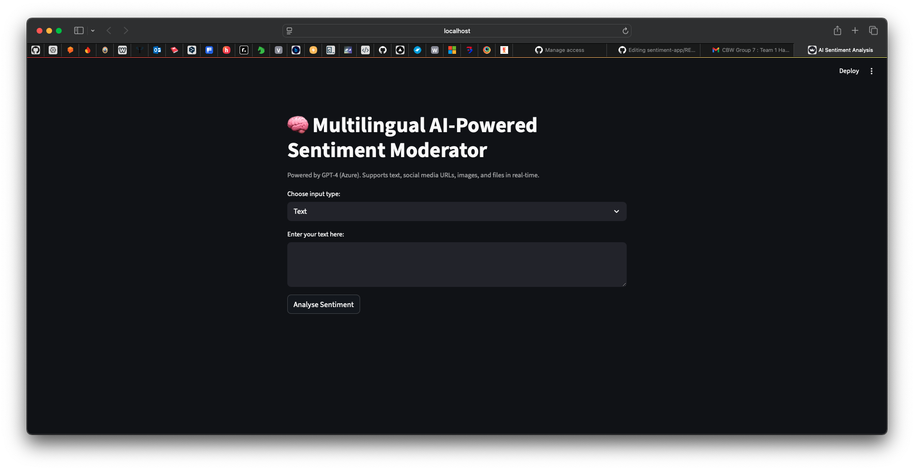
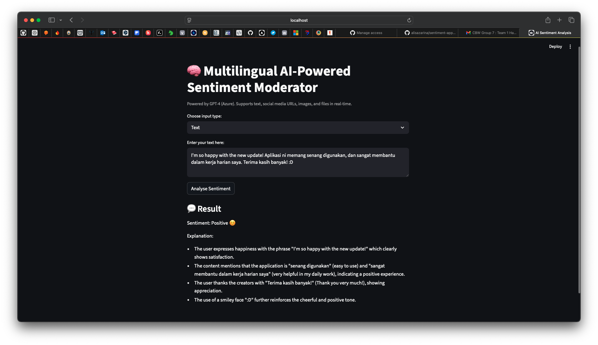

# 🧠 Sentiment Analysis Web App (Multilingual, AI-Powered)

This is a simple and interactive sentiment analysis tool powered by Azure OpenAI (GPT-4) and Streamlit. It supports multiple content types — text, URLs (simulated), images, PDFs, DOCX, and plain text files — for multilingual sentiment classification.

### // Update: Please take a look at this slide deck to detail the latest app functionality of this system.
[Microsoft Code; Without Barriers Hackathon — Sentiment App Presentation.pdf](https://github.com/user-attachments/files/26143275/Sentiment-App-Presentation2.pdf)

---

🖼️ Sample Screenshot




---

## 🚀 Features

- **Input types**: Text, URLs (WIP), images (WIP), .pdf, .docx, .txt
- **Sentiment analysis**: Powered by Azure OpenAI GPT-4
- **Multilingual support**
- **Clean and interactive UI using Streamlit**

---

## 📁 Project Structure
```
📦 sentiment-app/
├── app.py                 # Main Streamlit app
├── requirements.txt       # Python dependencies
├── .gitignore             # Git ignored files (files instructed to not commit to the Git repo)
└── .env                   # Environment variables (NOT committed in this Git repo)
```

---

## ⚙️ Prerequisites

- Python 3.8+
- A GitHub account with access to this private repo
- An Azure OpenAI key (from Jay, in 4th July 2025 email)

---

## 🛠️ Setup Instructions

### 1. Clone the repository

```
git clone https://github.com/alisazarina/sentiment-app.git
cd sentiment-app
```

### 2. Create a virtual environment

```
python -m venv venv
source venv/bin/activate   # For macOS/Linus
venv\Scripts\activate      # For Windows
```

### 3. Install dependencies

```
pip install -r requirements.txt
```

### 4. Create a .env file
- Refer to Jay's email on 4th July 2025 for the API key details.
- Create the .env file in the root directory:

```
touch .env   # or manually create the file
```
- Paste this structure inside the .env file:
```
AZURE_OPENAI_API_KEY=your_key_here
AZURE_OPENAI_API_VERSION=your_version_here
AZURE_OPENAI_API_BASE=your_endpoint_here
AZURE_DEPLOYMENT_NAME=your_deployment_name_here
```
(Replace the values with the ones Jay provided)

### 5. Run the app
```
streamlit run app.py
```
- This will open the app in your default web browser at http://localhost:8501

---

❗ Notes

- The URL input option is currently a placeholder (not yet scraping real content).
- The image input doesn't yet extract text — future enhancement pending.
- Only .txt, .pdf, and .docx files are supported under File Upload.

---

🙋‍♀️ Having issues?

- Make sure your .env file is filled correctly (no extra spaces or quotes).
- Make sure your virtual environment is activated before running the app.
- If streamlit is not recognized, try:
  ```
  python -m streamlit run app.py
  ```

